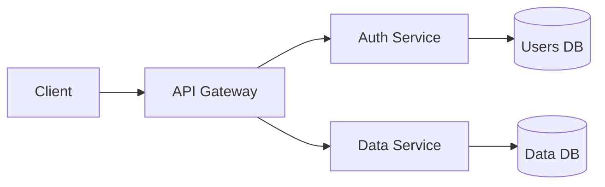

import { SlidePreview } from '../../components/SlidePreview'

# Bento

The default layout. Any slide with `###` cells uses the bento grid automatically — no `layout:` declaration needed. Cells are placed with bin-packing so you never need to specify positions.

## Basic Example

```markdown
---
theme: default
---

## Product Features

### :zap: Fast by Default {md}
Sub-10ms P99 latency across all API endpoints worldwide.

### **99.99%** {sm center}
Uptime SLA

### :shield: Security First {md}
SOC 2 Type II certified. End-to-end encryption on every plan.

### :users: Built for Teams {sm}
Real-time collaboration with role-based access control.

### 42 Regions
Global edge

### 2,400+
Customers
```

<SlidePreview code={`---
theme: default
title: Product Features
---

## Product Features

### :zap: Fast by Default {md}
Sub-10ms P99 latency across all API endpoints worldwide.

### **99.99%** {sm center}
Uptime SLA

### :shield: Security First {md}
SOC 2 Type II certified. End-to-end encryption on every plan.

### :users: Built for Teams {sm}
Real-time collaboration with role-based access control.

### 42 Regions
Global edge

### 2,400+
Customers`} />

## Size Hints

Add `{size}` at the end of any `###` line:

| Hint | Grid Span | Description |
|---|---|---|
| `{sm}` | 4 cols × 1 row | Small card |
| `{md}` | 6 cols × 1 row | Medium card — half width |
| `{lg}` | 8 cols × 1 row | Large card — two-thirds |
| `{wide}` | 12 cols × 1 row | Full-width banner |
| `{tall}` | 4 cols × 2 rows | Tall sidebar card |
| `{hero}` | 8 cols × 2 rows | Hero feature block |

Add `{center}` to center-align content inside any cell.

## Metric Cards

Use `**bold**` in a `###` title to render the bold portion at large display size:

```markdown
### **$12.4M** {md center}
Annual Recurring Revenue

### **340%** {sm center}
YoY Growth

### **98.7** {sm center}
NPS Score
```

<SlidePreview code={`---
theme: sunset
title: Q4 Results
style: tint
---

## Q4 Results

### **$12.4M** {md center}
Annual Recurring Revenue

### **340%** {sm center}
YoY Growth

### **98.7** {sm center}
NPS Score

### :users: 2,400+ Enterprise Customers {wide}
Trusted by Fortune 500 companies across 45 countries. Average contract value of $52K with 142% net dollar retention.`} />

## Image Cells

Add `` as the only body content for a full-bleed image card. Add it alongside text for an inline image below the content.

```markdown
### Tokyo {tall}
Neon-lit streets and endless energy.


### :utensils: Food Culture
Japan has more Michelin stars than any other country.
```

<SlidePreview code={`---
theme: forest
title: Japan Guide
---

## Japan Travel Guide

### Kyoto, Japan {hero}
Ancient temples, serene gardens, and cherry blossom season.


### Tokyo {tall}
Neon-lit streets and endless energy.


### :utensils: Food & Culture
More Michelin stars than any other country.

### :map: Getting Around
JR Pass covers bullet trains nationwide.`} />

## Lists in Cells

Markdown bullet lists inside a cell render as a styled list:

```markdown
### :check-circle: What's Included {md}
- Unlimited projects
- Priority support
- Custom domain
- SSO and audit logs
```

<SlidePreview code={`---
theme: berry
title: Pricing
style: tint
---

## Pricing

### Starter — Free {md}
- Up to 3 projects
- Community support
- Public repos only

### Pro — $49/mo {md highlight}
- Unlimited projects
- Priority support
- Custom domain

### :check-circle: All Plans Include {wide}
- 99.99% uptime SLA · End-to-end encryption · 42 global regions · SOC 2 compliance`} />

## Mermaid Diagrams in Cells

Add a ` ```mermaid ``` ` block inside any cell to render a diagram:

````markdown
### Architecture {hero}

````

<SlidePreview code={`---
theme: ocean
title: System Architecture
---

## System Architecture

### Architecture Overview {hero}
\`\`\`mermaid
graph LR
  A[Client] --> B[API Gateway]
  B --> C[Auth Service]
  B --> D[Data Service]
  C --> E[(Users DB)]
  D --> F[(Data DB)]
\`\`\`

### :zap: Edge Cached {sm}
All static assets served from CDN

### :shield: Zero Trust {sm}
Every request authenticated

### **42** Regions {sm center}
Worldwide`} />

## Using Explicit `layout: bento`

You can also use explicit frontmatter for slides that need additional options like `background:` or `style:`:

```markdown
---
layout: bento
background: "#0f172a"
style: solid
heading: "Dark Slide"
---

### :moon: Night Mode {md}
Dark background with solid cell colors.

### **100%** {sm center}
Test coverage
```

<SlidePreview code={`---
theme: default
title: Dark Slide
---

## Dark Slide Example

### :moon: Night Mode {md}
Dark backgrounds work automatically — text color adapts for contrast.

### **100%** {sm center}
Test coverage

### :shield: Secure by Default {md}
Zero-trust architecture with end-to-end encryption across all tiers.

### :zap: Fast {sm}
12ms avg response`} />

## Tips

- Cells are auto-placed — you never specify grid coordinates
- Row gaps are automatically filled by expanding the last cell in a row
- Mix `{hero}` or `{tall}` with `{sm}` cells for visual hierarchy
- `{center}` works best on metric cards with large bold values
- Image cells: `` alone = background fill; with text = inline image below content
