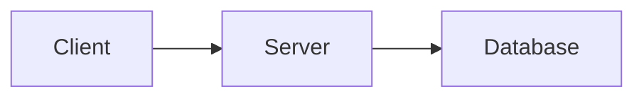

import { SlidePreview } from '../../components/SlidePreview'

# mermaid

Embed Mermaid diagrams in any layout using standard ` ```mermaid ` code blocks. Diagram colors automatically match your slide palette.


## Flowchart

<SlidePreview code={`---
title: "System Architecture"
aspectRatio: "16:9"
palette:
  primary: "#2563eb"
---

---
layout: default
heading: "Request Processing Pipeline"
summary: "How a single API request flows through our system"
footer: true
pageNumber: true
---

\`\`\`mermaid
graph LR
    A[Client] --> B[API Gateway]
    B --> C{Auth}
    C -->|Valid| D[Load Balancer]
    C -->|Invalid| E[401 Error]
    D --> F[Service A]
    D --> G[Service B]
    F --> H[(Database)]
    G --> H
    H --> I[Cache]
    I --> A
\`\`\``} />

## Sequence Diagram

<SlidePreview code={`---
title: "Auth Flow"
aspectRatio: "16:9"
palette:
  primary: "#059669"
  secondary: "#10b981"
---

---
layout: default
heading: "OAuth 2.0 Authentication Flow"
summary: "Secure token-based authentication with refresh flow"
footer: true
pageNumber: true
---

\`\`\`mermaid
sequenceDiagram
    participant U as User
    participant A as App
    participant S as Auth Server
    participant R as Resource API

    U->>A: Click Login
    A->>S: Authorization Request
    S->>U: Login Page
    U->>S: Credentials
    S->>A: Authorization Code
    A->>S: Exchange Code + Secret
    S->>A: Access Token + Refresh Token
    A->>R: API Request + Token
    R->>A: Protected Data
    A->>U: Show Dashboard
\`\`\``} />

## Two Column with Diagram

Combine a diagram with text explanation using `two-column` layout.

<SlidePreview code={`---
title: "Architecture"
aspectRatio: "16:9"
palette:
  primary: "#6366f1"
---

---
layout: two-column
heading: "Microservices Architecture"
summary: "Event-driven communication between bounded contexts"
footer: true
pageNumber: true
---

## System Design

\`\`\`mermaid
graph TD
    A[API Gateway] --> B[User Service]
    A --> C[Order Service]
    A --> D[Payment Service]
    B --> E[Event Bus]
    C --> E
    D --> E
    E --> F[Notification Service]
    E --> G[Analytics Service]
\`\`\`

## Key Benefits

- **Loose coupling** — Services communicate via events, not direct calls
- **Independent deployment** — Each service has its own CI/CD pipeline
- **Fault isolation** — One service failing doesn't cascade to others
- **Technology freedom** — Each team picks the best tool for the job`} />

## Usage

Use standard Markdown fenced code blocks with the `mermaid` language tag:

````markdown
---
layout: default
heading: "System Design"
---


````

## Supported Diagram Types

All Mermaid diagram types work:

| Type | Syntax |
|---|---|
| Flowchart | `graph LR` / `graph TD` |
| Sequence | `sequenceDiagram` |
| Class | `classDiagram` |
| State | `stateDiagram-v2` |
| ER | `erDiagram` |
| Gantt | `gantt` |
| Pie | `pie` |
| Git Graph | `gitGraph` |
| Mindmap | `mindmap` |

## Gantt Chart

<SlidePreview code={`---
title: "Project Timeline"
aspectRatio: "16:9"
palette:
  primary: "#6366f1"
---

---
layout: default
heading: "Q2 Development Roadmap"
summary: "Feature delivery timeline across three workstreams"
footer: true
pageNumber: true
---

\`\`\`mermaid
gantt
    title Q2 2026 Roadmap
    dateFormat YYYY-MM-DD
    axisFormat %b %d

    section Backend
    API Redesign        :a1, 2026-04-01, 21d
    Database Migration   :a2, after a1, 14d
    Load Testing         :a3, after a2, 7d

    section Frontend
    Component Library    :b1, 2026-04-01, 28d
    Dashboard Rebuild    :b2, after b1, 21d

    section DevOps
    CI/CD Pipeline       :c1, 2026-04-07, 14d
    Monitoring Setup     :c2, after c1, 14d
    Production Deploy    :milestone, c3, after c2, 0d
\`\`\``} />

## Pie Chart

<SlidePreview code={`---
title: "Market Share"
aspectRatio: "16:9"
palette:
  primary: "#059669"
---

---
layout: default
heading: "Cloud Market Share 2026"
summary: "Global IaaS market distribution by provider"
footer: true
pageNumber: true
---

\`\`\`mermaid
pie title Market Share
    "AWS" : 31
    "Azure" : 25
    "Google Cloud" : 11
    "Alibaba" : 6
    "Others" : 27
\`\`\``} />

## Entity Relationship

<SlidePreview code={`---
title: "Data Model"
aspectRatio: "16:9"
palette:
  primary: "#dc2626"
---

---
layout: default
heading: "Core Data Model"
summary: "Entity relationships for the order management system"
footer: true
pageNumber: true
---

\`\`\`mermaid
erDiagram
    CUSTOMER ||--o{ ORDER : places
    ORDER ||--|{ LINE_ITEM : contains
    ORDER ||--|| PAYMENT : "paid by"
    PRODUCT ||--o{ LINE_ITEM : "ordered in"
    CUSTOMER {
        string name
        string email
        string tier
    }
    ORDER {
        int id
        date created
        string status
    }
    PRODUCT {
        int id
        string name
        float price
    }
\`\`\``} />

## State Diagram

<SlidePreview code={`---
title: "Order States"
aspectRatio: "16:9"
palette:
  primary: "#2563eb"
---

---
layout: default
heading: "Order Lifecycle"
summary: "State transitions from creation to completion"
footer: true
pageNumber: true
---

\`\`\`mermaid
stateDiagram-v2
    [*] --> Draft
    Draft --> Submitted : Submit
    Submitted --> Processing : Accept
    Submitted --> Rejected : Reject
    Processing --> Shipped : Ship
    Shipped --> Delivered : Confirm
    Delivered --> [*]
    Rejected --> [*]
    Processing --> Cancelled : Cancel
    Cancelled --> [*]
\`\`\``} />

## Palette Integration

Mermaid themes automatically use your slide's palette colors:

- **Node borders** -- `primary` color
- **Node backgrounds** -- `surface` color
- **Text** -- `text` color
- **Lines/arrows** -- `muted` color
- **Active tasks** -- `secondary` color
- **Pie chart segments** -- `primary`, `secondary`, and complementary colors

No extra configuration needed -- just set your palette and diagrams match.

## Tips

- Mermaid.js is loaded from CDN only when diagrams are present (no overhead for non-diagram slides)
- Works in any layout: `default`, `two-column`, `image-left`, `image-right`
- Keep diagrams to 8-12 nodes max for readability at presentation scale
- Use `graph LR` (left-to-right) for wide slides, `graph TD` (top-down) for two-column
